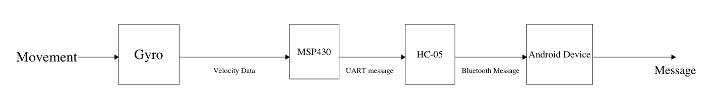

# 327-Project
## Overview
This is a repository for documenting an embedded systems by Thomas Pickell and Noah Villa. Our project aims to detect when a person has fallen and sned a message via Bluetooth to a mobile device. The device is intended for applications in elder care, similar to products like LifeAlert, and aims to provide an automatic resonse to emergency situations.

## Contents
The repository contains our final code, in the 'main.c' file, as well as intermediary steps including our non integrated CCS code, in the 'ccs' directory, and the prototype Arduino implementation that can be found in the 'arduino' directory.

## Use
Presently, Our full implementation only works in Arduino. We weren't able to fully debug an integrated version that includes both I2C and Bluetooth. the code in 'main.c' is a compilable C project that is intended to send and recieve bluetooth and I2C data.

MSP430: to run our CCS implementation, simply downlaod the file main.c and upload it to a MSP430FR2433 board, setting up your board according to the following pinout:     
- I2C SDA (Serial Data): P1.7
- I2C SCL (Serial Clock):P1.6
- Bluetooth RX: P1.5
- Bluetooth TX: P1.4
- Both the Gyro and Bluetooth module should be powered with 5V, and 2 4.7k pullup resistors on 3.3V should be attatched to the clock and data lines of the I2C bus.
It's important to note that since our project utilizes a different MSP than the one used in class, some register names are different and the code is therefore not cross-platform.

## DEMONSTRATION:
A Live demonstration of our project can be found [here](https://drive.google.com/file/d/1XZIgEVxlYv1pwuqYM_hLLPm6eGMVjQot/view).

# Components
## I2C
I2C is a serial communications protocol that allows for transmission and reception of data over a clock and data line. DataFrames are sent in 8-bit chunks, along with an address and some logistical information.
### MPU6050
The MPU6050 is a 6-axis gyroscopic sensor and accelerometer, which we use to measure the positional data for our project. To do this, we send messages that include the MPU's address, as well as the register we wish to read. To configure the gyro, we do a similar process, but include a bitmask with which to write to the specified address. The datasheet can be found [here](https://invensense.tdk.com/wp-content/uploads/2015/02/MPU-6000-Datasheet1.pdf).

## Bluetooth
Bluetooth is a wireless serial communications protocol that allows for fast data transmission over short distances.
### HC-05
The HC-05 Bluetooth module is a wireless communications device that allows communication between our MSP430 and most Android devices. It allows for ASCII commands to be sent via a Bluetooth terminal app. The datasheet can be found [here](https://components101.com/sites/default/files/component_datasheet/HC-05%20Datasheet.pdf).

# Process
We began by dividing the work into 2 main focuses: configuring the Bluetooth module and establishing an I2C connection. This process was done solely in Code Composer Studio, with all code written in C. During this process, we encountered a series of issues and resolved to implementing the poject in Arduino first, then porting it to CCS when we had a functional prototype. This repository contains commented code for both implementations, found in the respective arduino and CCS folders. The wiring and components are identical for either implementation of the project.

